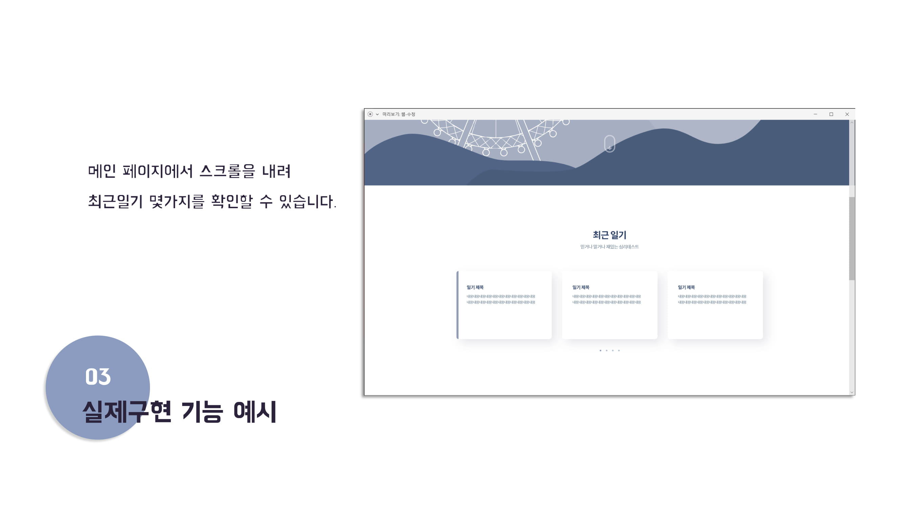
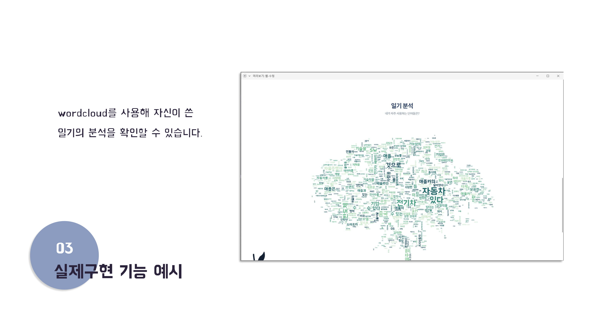
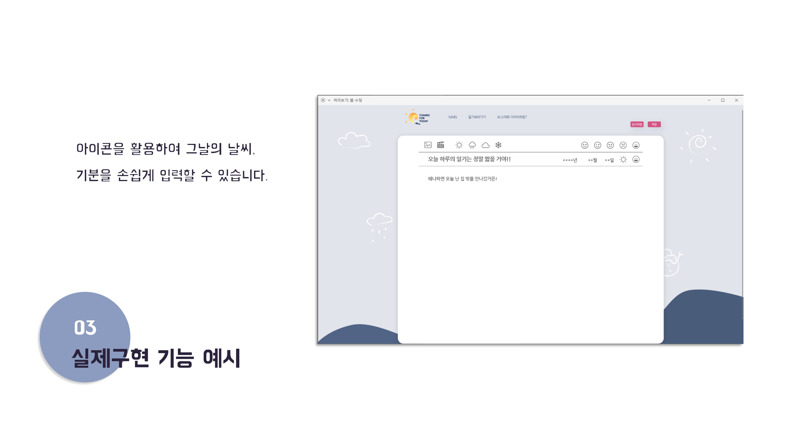
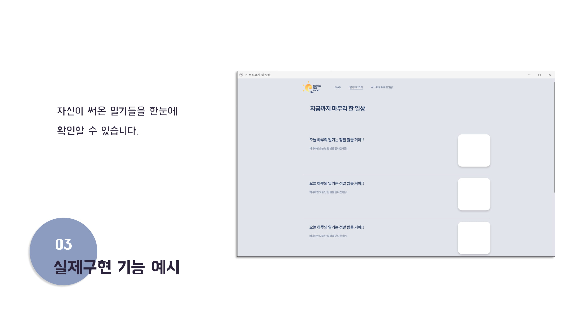

# Thanks For Today: 나를 알려주는 스마트한 일기장
당신에 대해 잘 알아갈 수 있는 스마트한 일기장

#### SW중심대학 공동해커톤

행사명: SW중심대학 공동해커톤

일시: 2021.2.4~6(목~토)

##
당신은 자신을 잘 알고 있나요?

당신의 소중한 일상을 기록하고

당신이 무엇을 좋아하는지, 어떤 사람인지 알아가 봅시다.

당신을 더 잘 알아갈 수 있는 일기장 "Thanks For Today"

## :twisted_rightwards_arrows: 서비스

## :computer: 기술 스택

### Natural Language Processing
Python ('summa', 'hanspell', 'WordCloud', 'koNLPy-gRPC(커먼컴퓨터 API)')

### Front
React

### Backend
Python Django

[REST API 문서](https://github.com/seongjunChoi0714/ThanksForToday/blob/master/django-backend/README.md)

## :busts_in_silhouette:팀원

- 최성준 경희대학교 (개발자, 팀장) [@seongjunChoi0714](https://github.com/seongjunChoi0714)

- 권나영 선문대학교 (디자이너)

- 금빛나 광운대학교 (개발자) [@BitnaKeum](https://github.com/BitnaKeum)

- 박정섭 국민대학교 (개발자) [@ParkJeongseop](https://github.com/ParkJeongseop)

- 최은지 동국대학교 (개발자) [@choieunii](https://github.com/choieunii)
